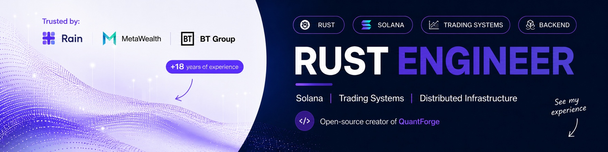
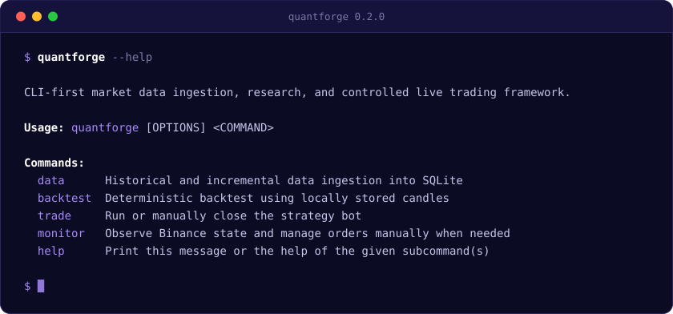
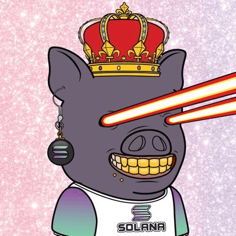
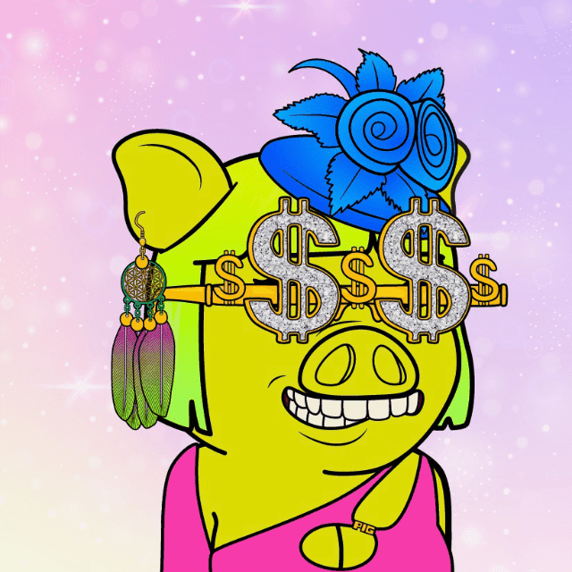

<h2>Hi, I'm Marko 👋</h2>

  
  
  

Rust engineer, 18+ years building backends — trading systems, Solana infrastructure and distributed services for **Rain**, **MetaWealth** and **BT Group**.

These days I build two things: **QuantForge**, a trading framework where a backtest gives you the same answer every single time you run it, and **Piggy Gang**, a Solana NFT ecosystem with a Rust indexer underneath. I like determinism, clean boundaries between the parts, and the shortest dependency list that does the job.

<h2 align="center">🦀 QuantForge</h2>

**A trading framework for Rust. Pull in market data, backtest a strategy, run it live — all from the terminal.**

  
  

  
  
  
  
  

- **Dry-run can't trade, by construction.** It isn't a flag you might forget — in dry-run the engine has no exchange attached at all.
- **Backtests are reproducible.** The same data and settings give the same result every run. No clock, no randomness, no network.
- **No floating point for money.** Everything is decimal, because `f64` quietly loses cents.
- **It refuses the wrong resume.** Change the market, the strategy or the mode and it stops, so a paper position can never turn into a real one.
- **Built to be trusted with money.** No `unsafe`, no `unwrap()`, half the codebase is tests, CI on Linux, macOS and Windows.
- **Strategies don't have to be Rust.** The interface is plain data in and plain data out, so other languages can plug in.

**[quantforge.rs](https://quantforge.rs)** · **[github.com/quantforge-rs](https://github.com/quantforge-rs)** · `cargo install quantforge`

Engineering software. Not investment advice, and no promise of profit.

<h2 align="center">🐷 Piggy Gang</h2>

**Four NFT collections on Solana, a Rust indexer, and five web apps — all built in the open.**

  
  
  

  
  
  
  

- **One spec runs the whole stack.** The indexer's OpenAPI file is the source of truth; the explorer generates its client from it, and CI fails if the two drift apart.
- **The frontend shipped before the backend.** It runs against a mock built from that same spec — one environment variable switches it to the real API.
- **The database enforces the rules.** A Postgres constraint makes it impossible for one NFT to have two owners at the same time.
- **Search is quick.** Filtering by traits across 10,000 NFTs comes back in about 35 ms.
- **Three dependencies talk to Solana.** No web3.js, no wallet-adapter. Keys never reach a server — the browser signs, the app just watches.
- **We kept the art.** The collections' original image host went dark; these repos hold what may be the only complete copy left.

| Repo | Lang | What it does | Live |
|---|---|---|---|
| [`indexer`](https://github.com/piggygang/indexer) | Rust | Indexes every Piggy NFT — traits, owners and full history — and serves them over a REST API | — |
| [`explorer`](https://github.com/piggygang/explorer) | TypeScript | Search the collections by trait, look up a wallet, read an NFT's history | [explorer.piggygang.net](https://explorer.piggygang.net) |
| [`dressme`](https://github.com/piggygang/dressme) | TypeScript | Dress your piggy up in any traits you like and download the picture | [dressme.piggygang.net](https://dressme.piggygang.net) |
| [`raffles`](https://github.com/piggygang/raffles) | TypeScript | Free raffles for holders — nobody ever pays to enter | [raffles.piggygang.net](https://raffles.piggygang.net) |
| [`alpha-art`](https://github.com/piggygang/alpha-art) | TypeScript | alpha.art coming back as an open-source Solana marketplace | [alpha.art](https://alpha.art) |
| [`website`](https://github.com/piggygang/website) | TypeScript | The hub — every app and collection in one place | [piggygang.net](https://piggygang.net) |

**[piggygang.net](https://piggygang.net)** · **[github.com/piggygang](https://github.com/piggygang)**

Piggy SOL Gang (10,000) · Piggy Girl Gang (5,000) · Piggy Gang (10,000 — same piggies, meaner art) · Pig Mud (2,073) · $PIGGY

<h2 align="center">About me 🦀</h2>

<b>🌍 Slovenia — CET/CEST, <code>Europe/Ljubljana</code></b>

🔸 **Right now:** [QuantForge](https://github.com/quantforge-rs) — Binance and SQLite today, Bybit and Postgres next — and the [Piggy Gang](https://github.com/piggygang) stack. 
🔸 **Good at:** backends that behave predictably — exact arithmetic, no look-ahead, and safety you can't switch off by accident. 
🔸 **Solana:** Token Metadata and Core, Helius backfill and live streaming, wallets that sign in the browser and nowhere else. 
🔸 **Infrastructure:** small hardened containers, one Dockerfile for a whole workspace, config kept as code. 
🔸 **Ask me about:** why a backtest should be a pure function, and why changing an API contract is always two commits.

<h2 align="center">⚒️ Languages · Frameworks · Tools ⚒️</h2>

  
   
  

<picture>
  <source media="(prefers-color-scheme: dark)"  srcset="https://raw.githubusercontent.com/formaldehid/formaldehid/output/github-snake-dark.svg" />
  <source media="(prefers-color-scheme: light)" srcset="https://raw.githubusercontent.com/formaldehid/formaldehid/output/github-snake.svg" />
  
</picture>

  
  

More repos are being opened up as they stabilize.

